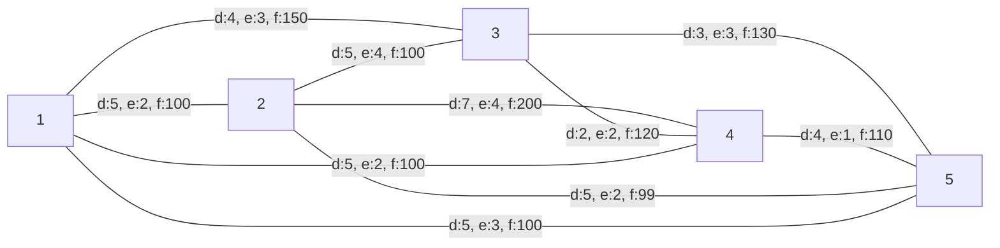

# Ejercicio 6 - Mejora de calles IMM

## Descripción
La IMM (Intendencia Municipal de Montevideo) se propuso mejorar el estado de las calles que unen los distintos barrios de la ciudad con el fin de mejorar la conectividad y reducir los tiempos de viaje. El proyecto consiste en desarrollar una red vial eficiente que conecte todos los barrios, minimizando la cantidad de caminos a mejorar y su distancia. Para establecer un criterio de selección adecuado la IMM solicita:
   1. Se quieren minimizar la distancia total a reparar.
   2. Si dos calles tienen la misma distancia se preferirá reparar aquel que tenga mejor estado.
   3. Si el criterio anterior no es suficiente, se priorizará aquella calle que admita un mayor flujo de tránsito vehicular.
   4. Si lo anterior no establece un orden, se considerará la calle con id más pequeño primero.

## Entrada 
La entrada consistirá en:
1. Un número entero `B` que representa el número de barrios en Montevideo.
2. Un número entero `L` que representa la cantidad de calles que unen los barrios.
3. `L` líneas cada una conteniendo 5 valores separados por un espacio: `barrio1` `barrio2` `idCalle` `distancia` `flujo` `estado`

   - `barrio1` y `barrio2` serán enteros que simbolizan los barrios
   - `idCalle`, entero único para cada calle que la identifica inequivocamente
   - `distancia`, representa la distancia entre los barrios en km 
   - `flujo`, valor numérico que representa la cantidad de vehículos que admite la calle por hora
   - `estado`, calificación del 1 al 10 donde 1 es mejor estado 

## Salida
Se deben imprimir todos los detalles de las calles a reparar con el siguiente formato
`barrio1` `barrio2` `idCalle` `distancia` `flujo` `estado`

Además se debe imprimir las siguientes líneas

`Distancia total a reparar: X`  
`Estado promedio de las calles reparadas: Y` (redondeado a entero, se puede usar la función `round` de `cmath`)

Donde `X` e `Y` son los valores correspondientes al cálculo realizado.

## Restricciones
- $1 \leq barrio \leq 10^6$
- $1 \leq distancia \leq 30$
- $1 \leq flujo \leq 1000$
- $1 \leq estado \leq 10$
- Resolver en $O(L \log B)$ temporal

## Ejemplo 1

### Input
4  
5  
1 2 1 6 200 2  
2 3 2 6 250 3  
1 3 3 4 150 4  
3 4 4 5 100 5  
2 4 5 7 300 1 

### Output
1 3 3 4 150 4  
3 4 4 5 100 5  
1 2 1 6 200 2  
Distancia total a reparar: 15  
Estado promedio de las calles reparadas: 3  

## Ejemplo 2

### Input
5  
10  
1 2 1 5 100 2  
1 3 2 4 150 3  
2 4 3 7 200 4  
3 4 4 2 120 2  
3 5 5 3 130 3  
4 5 6 4 110 1  
2 5 7 5 99 2  
1 4 8 5 100 2  
1 5 9 5 100 3  
2 3 10 5 100 4  

### Output
3 4 4 2 120 2  
3 5 5 3 130 3  
1 3 2 4 150 3  
1 2 1 5 100 2  
Distancia total a reparar: 14  
Estado promedio de las calles reparadas: 2
